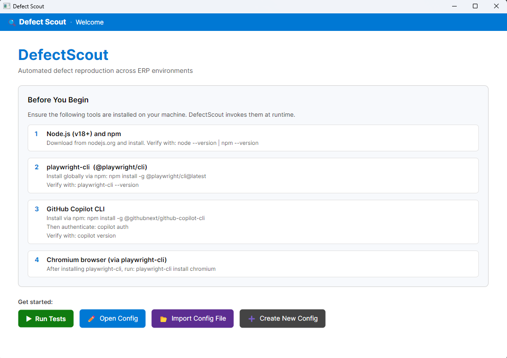
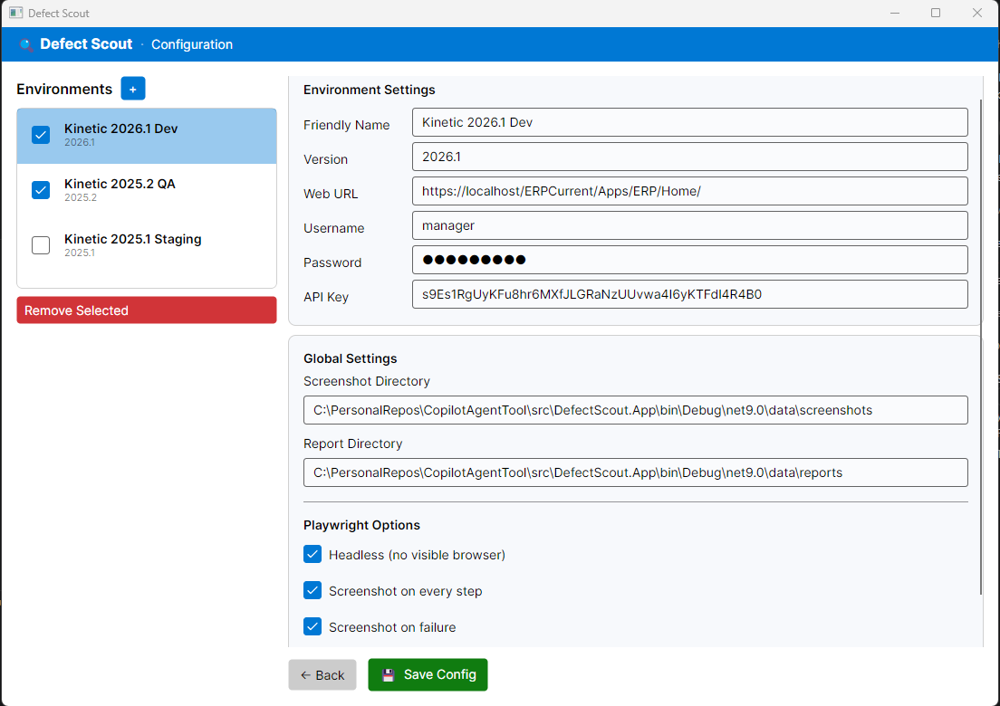
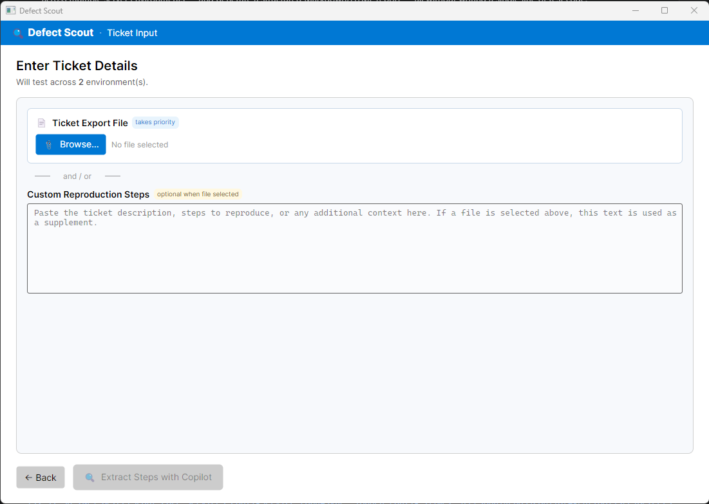
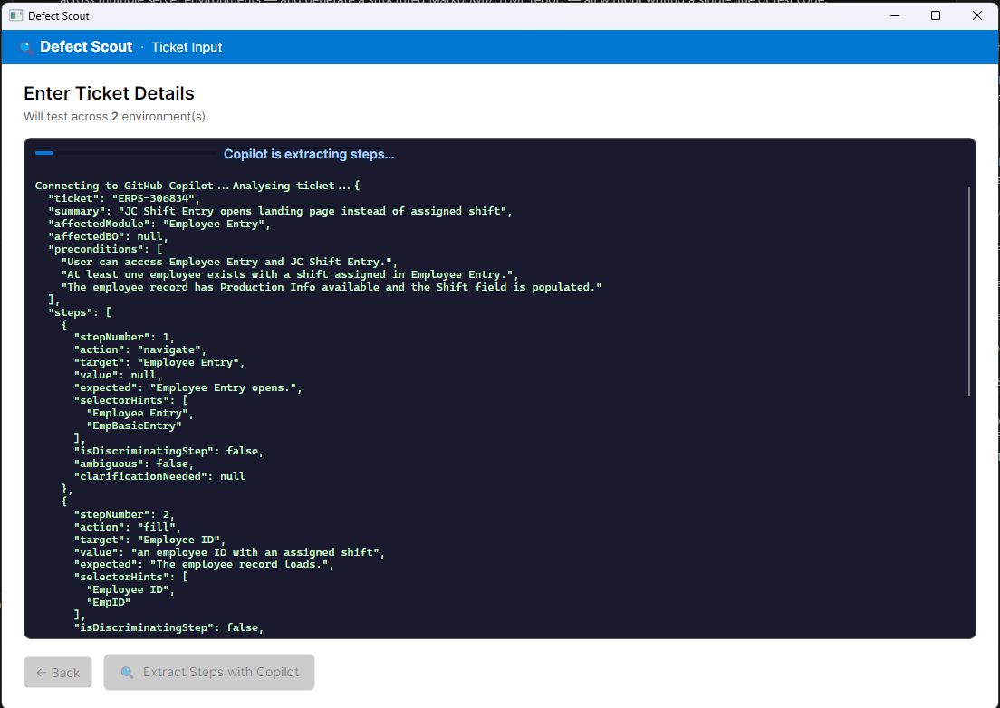
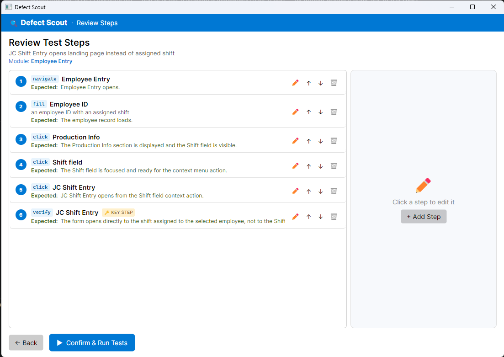
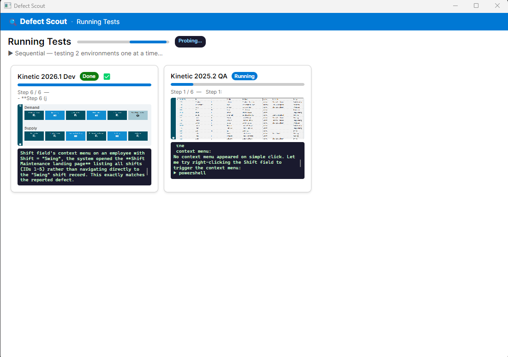
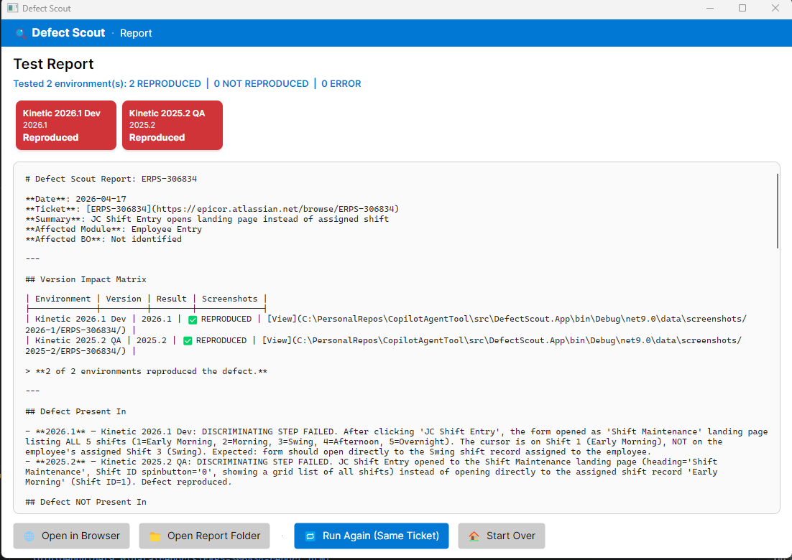

# Defect Scout

**Defect Scout** is a Windows desktop application that uses the **GitHub Copilot SDK** and **Playwright** to automatically reproduce Kinetic ERP defects across multiple server environments — and generate a structured Markdown/HTML report — all without writing a single line of test code.

You paste a sustaining ticket. Defect Scout extracts the reproduction steps with AI, drives a real browser against every configured Kinetic environment in parallel, and delivers a side-by-side version-impact report so you always know which versions are affected and which are clean.

---

## Table of Contents

1. [How It Works](#how-it-works)
2. [Screenshots](#screenshots)
3. [Pre-requisites](#pre-requisites)
4. [Getting Started](#getting-started)
5. [Configuration Reference](#configuration-reference)
6. [Application Flow (Screens)](#application-flow-screens)
7. [Output Artefacts](#output-artefacts)
8. [Benefits by Vertical](#benefits-by-vertical)
9. [Tech Stack](#tech-stack)

---

## How It Works

Defect Scout runs a three-phase AI pipeline orchestrated entirely through the GitHub Copilot SDK:

```
Ticket Text / File
        │
        ▼
┌─────────────────────────────┐
│  Phase 1 — Step Extractor   │  GitHub Copilot (gpt-5.4)
│  Parses raw ticket text     │  → StructuredTestPlan JSON
│  into environment-agnostic  │    (steps, preconditions,
│  reproduction steps         │     discriminating step)
└─────────────┬───────────────┘
              │
              ▼
┌─────────────────────────────┐
│  Phase 2 — Env Tester       │  One Copilot SDK session
│  Drives playwright-cli      │  per environment, all
│  and Invoke-RestMethod      │  running in parallel
│  against each Kinetic server│  → TestResult JSON per env
└─────────────┬───────────────┘
              │
              ▼
┌─────────────────────────────┐
│  Phase 3 — Reporter         │  Template-built in C#
│  Combines all TestResults   │  → .md + .html report
│  into a version-impact      │    (auto-opened in browser)
│  matrix report              │
└─────────────────────────────┘
```

### Phase 1 — Step Extraction

The **Step Extractor** agent sends the ticket text to GitHub Copilot with a tightly constrained system prompt. It returns a `StructuredTestPlan` JSON that contains:

- Ticket ID, summary, affected module, and affected Business Object
- Ordered reproduction steps with `action`, `target`, `value`, `expected`, and `selectorHints`
- A single **discriminating step** (`isDiscriminatingStep: true`) — the one step whose pass/fail conclusively proves or disproves the defect
- Preconditions and expected vs. actual results

No hardcoded URLs, credentials, or server addresses ever appear in the plan; it is fully environment-agnostic.

### Phase 2 — Environment Testing

The **Environment Tester** agent spins up one GitHub Copilot SDK session per Kinetic environment and executes the `StructuredTestPlan` autonomously using:

- **`playwright-cli`** for all UI interactions (navigate, click, fill, select, verify, screenshot)
- **`Invoke-RestMethod`** for OData REST API steps
- Self-signed certificate bypass, automatic login, and robust step-level screenshot capture

All sessions share a single `CopilotClient` process and run **concurrently** (fleet mode), dramatically reducing total wall-clock time. A sequential fallback is available when needed.

Each session writes a `TestResult` JSON file per environment capturing the verdict (`REPRODUCED` / `NOT_REPRODUCED` / `ERROR`), per-step results, and screenshot paths.

### Phase 3 — Report Generation

The **Report Service** assembles all `TestResult` objects into a polished dual-format report:

- **Markdown (`.md`)** — suitable for committing to version control or attaching to a JIRA ticket
- **HTML (`.html`)** — auto-opened in the system browser, with inline screenshots and a version-impact matrix table

---

## Screenshots

### 1. Welcome Screen



The **Welcome** screen validates your environment before you begin. It lists each required tool (Node.js, playwright-cli, GitHub Copilot CLI, Chromium) with install and verify instructions, then offers four entry points: **Run Tests**, **Open Config**, **Import Config File**, and **Create New Config**.

---

### 2. Configuration Screen



The **Configuration** screen manages your Kinetic environment inventory. Select an environment from the left panel to edit its **Friendly Name**, **Version**, **Web URL**, credentials, and **API Key**. Global settings for screenshot and report directories, plus all **Playwright Options** (headless mode, screenshot-on-step, screenshot-on-failure), are configured here and persisted to `defect-scout-config.json`.

---

### 3. Ticket Input



The **Ticket Input** screen accepts a defect ticket two ways: browse to an exported ticket file (`.txt`, `.xml`, `.md`, `.json`) or paste raw text directly into the **Custom Reproduction Steps** text area. A file takes priority when both are provided. Click **Extract Steps with Copilot** to start Phase 1.

---

### 4. Step Extraction — Live Copilot Output



While GitHub Copilot parses the ticket, a live console streams the raw JSON being generated. The output is the `StructuredTestPlan` — ticket ID, summary, affected module, preconditions, and fully structured reproduction steps with selector hints and a flagged **discriminating step**.

---

### 5. Step Review



The **Review Steps** screen shows every extracted step as an editable card: action badge (`navigate`, `fill`, `click`, `verify`), target, expected result, and a **KEY STEP** badge on the discriminating step. Steps can be reordered, edited, or deleted before committing. Click **Confirm & Run Tests** to dispatch the fleet.

---

### 6. Running Tests — Live Environment Progress



Each environment card updates in real time: current step, a live log feed, and a captured screenshot. The header badge transitions from **Probing...** → **⚡ Fleet (parallel)** or **▶ Sequential** once dispatch mode is determined. Completed environments show a green **Done** badge with a checkmark.

---

### 7. Report Screen



The **Report** screen renders the assembled Markdown report inline. The summary bar shows totals for **REPRODUCED**, **NOT REPRODUCED**, and **ERROR** across all environments. Coloured version cards at the top provide an at-a-glance version impact matrix. From here you can **Open in Browser** (the fully styled HTML report with inline screenshots), **Open Report Folder**, **Run Again (Same Ticket)**, or **Start Over**.

---

## Pre-requisites

| Requirement | Minimum Version | Notes |
|---|---|---|
| **Windows** | Windows 10 (x64) | Required by Avalonia Desktop + the Copilot CLI bundled binary |
| **.NET SDK** | 9.0 | `dotnet --version` to verify |
| **GitHub Copilot subscription** | Active seat | Individual, Business, or Enterprise plan. The app authenticates via the locally installed Copilot CLI. |
| **GitHub Copilot CLI** | Latest | Install with `gh extension install github/gh-copilot` or via `npm install -g @github/copilot-cli`. Must be authenticated (`gh auth login`). |
| **Node.js** | 18 LTS or newer | Required indirectly by `playwright-cli`. |
| **playwright-cli** | Latest | Installed automatically if not found; or manually: `npm install -g @playwright/cli` |
| **PowerShell** | 7+ (pwsh) | Used by the Env Tester agent to run `playwright-cli` commands and `Invoke-RestMethod` API calls |
| **Access to Kinetic environments** | Any supported version | The environments you add to `defect-scout-config.json`. HTTPS self-signed certificates are handled automatically. |

> **Tip:** Run `playwright-cli --version` in a terminal to verify the Playwright CLI is on your PATH before starting a run.

---

## Getting Started

### 1. Clone and Build

```powershell
git clone <repo-url>
cd CopilotAgentTool
dotnet build DefectScout.sln
```

### 2. Run the App

```powershell
dotnet run --project src/DefectScout.App/DefectScout.App.csproj
```

Or open `DefectScout.sln` in Visual Studio / Rider and press **F5**.

### 3. Configure Environments

On first launch, click **Open Config** on the Welcome screen. Add one entry per Kinetic server you want to test. At minimum you need:

- `name` — display label (e.g. `"Kinetic 2026.1 Dev"`)
- `version` — used for report grouping (e.g. `"2026.1"`)
- `webUrl` — full URL to the Kinetic ERP home page
- `restApiBaseUrl` — base OData v2 URL
- `apiKey` or `username`/`password`/`company`

Set `enabled: true` for every environment you want included in fleet runs.

### 4. Run a Test

1. From the **Welcome** screen, click **Run Tests**
2. Paste the ticket ID and/or raw ticket description on the **Ticket Input** screen
3. Optionally attach a ticket file (`.txt`, `.xml`, `.md`, `.json`)
4. Click **Extract Steps** — watch the AI parse the ticket into a structured plan
5. Review extracted steps on the **Step Review** screen; click **Run Tests**
6. Monitor per-environment progress cards on the **Running Tests** screen
7. When complete, the HTML report opens automatically in your browser

---

## Configuration Reference

The configuration file is `defect-scout-config.json` (stored next to the executable and editable via the in-app Setup screen).

```jsonc
{
  "environments": [
    {
      "name": "Kinetic 2026.1 Dev",
      "version": "2026.1",
      "enabled": true,
      "webUrl": "https://my-server/ERPCurrent/Apps/ERP/Home/",
      "restApiBaseUrl": "https://my-server/ERPCurrent/api/v2/odata/EPIC06/",
      "apiKey": "",            // Preferred: Kinetic REST API key
      "username": "manager",   // Fallback if apiKey is empty
      "password": "...",
      "company": "EPIC06",
      "notes": "Optional free-text note"
    }
  ],
  "screenshotBaseDir": "",  // Defaults to <appdir>/screenshots
  "reportDir": "",          // Defaults to <appdir>/reports
  "logDir": "",             // Defaults to <appdir>/logs
  "playwright": {
    "timeout": 30000,             // ms per playwright-cli action
    "screenshotOnStep": true,     // Screenshot after every step
    "screenshotOnFailure": true,  // Screenshot on any exception
    "headless": true,             // Run browser headlessly
    "ignoreHttpsErrors": true     // Bypass self-signed certs
  }
}
```

---

## Application Flow (Screens)

| # | Screen | Screenshot | Purpose |
|---|---|---|---|
| 1 | **Welcome** | [View](docs/welcome_screen.png) | Load existing config, import a config from another location, or jump straight to testing |
| 2 | **Configuration (Setup)** | [View](docs/config_screen.png) | Add/edit/remove Kinetic environments; set screenshot, report, and Playwright options |
| 3 | **Ticket Input** | [View](docs/ticket_details.png) | Paste ticket text or browse to a ticket file; trigger AI step extraction |
| 3a | **Step Extraction** | [View](docs/steps_extractor.png) | Live Copilot output streamed while the `StructuredTestPlan` JSON is being generated |
| 4 | **Step Review** | [View](docs/steps_review.png) | Inspect the AI-generated `StructuredTestPlan` before executing; confirm or go back |
| 5 | **Running Tests** | [View](docs/running-tests.png) | Live per-environment progress cards (step counter, log stream, screenshot preview) |
| 6 | **Report** | [View](docs/results_screen.png) | Rendered Markdown report in-app; open HTML in browser; run again or start over |

---

## Output Artefacts

All output lands under the directories configured in `defect-scout-config.json`.

```
reports/
  ERPS-123456-report.md      ← Markdown report (commit to VCS / attach to JIRA)
  ERPS-123456-report.html    ← Styled HTML report (auto-opened in browser)

screenshots/
  2026-1/
    ERPS-123456/
      step-00-login.png
      step-01-navigate.png
      step-03-discriminating-FAIL.png
      ...
  2025-2/
    ERPS-123456/
      step-06-discriminating-PASS.png
      ...

logs/
  defectscout-YYYY-MM-DD.log

<appdir>/
  ERPS-123456-steps.json     ← Structured test plan (for traceability)
  ERPS-123456-<env>.json     ← Raw TestResult per environment
```

---

## Benefits by Vertical

### Engineering / Development

- **Instant regression signal** — know within minutes whether a defect is present in your current dev build vs. older branches, without manually navigating Kinetic and hunting for the failure
- **Zero test-code overhead** — no spec files, no `.spec.ts` boilerplate; the AI writes and executes all interactions directly from the ticket description
- **Parallel fleet execution** — all configured environments are tested simultaneously; a 6-environment suite takes the same time as a single run
- **Discriminating-step focus** — the AI identifies and flags the single step that proves or disproves the defect, so you go straight to the root cause without reviewing every screenshot
- **Structured test plans as artefacts** — the `*-steps.json` file is committed alongside the fix, creating a permanent regression guard specification reusable in future runs

### QA / Test Engineering

- **Environment-agnostic reproduction** — steps never embed server URLs or credentials; the same plan runs identically on Dev, QA, Staging, and Production-like environments
- **Automated screenshot trail** — a full step-by-step screenshot is captured for every environment, giving QA a pixel-level audit trail without manual screen recording
- **Version-impact matrix** — the report table immediately shows `✅ REPRODUCED` / `❌ NOT REPRODUCED` / `⚠ ERROR` per version, mapping defect blast radius directly to release lines
- **Reduces manual repro cycle** — QA engineers no longer spend hours manually driving Kinetic through multi-step reproduction paths; Defect Scout handles it in one unattended run
- **Consistent, repeatable results** — the headless Playwright browser eliminates human variability (missed clicks, wrong company code, forgotten pre-conditions)

### Customer Support / Sustaining Engineering

- **Rapid triage** — paste a customer ticket straight from JIRA; within minutes know whether the issue is reproducible in the customer's reported version and whether a newer version resolves it
- **Evidence-backed responses** — the HTML report with inline screenshots provides unambiguous evidence to send back to customers or attach to escalation tickets
- **Version boundary identification** — when a defect is reproduced in `2025.1` and `2025.2` but not `2026.1`, support can confidently advise whether an upgrade resolves the issue
- **Reduced escalation noise** — support agents can self-serve on reproduction rather than routing every ticket to engineering for a manual repro pass
- **JIRA-ready report links** — every report header contains a clickable Jira hyperlink (`https://epicor.atlassian.net/browse/{ticket}`), keeping triage in context

### Release Management / Product Management

- **Go/no-go confidence** — run Defect Scout across all target environments before a release cut to confirm no regressions across the version matrix
- **Blast-radius visibility** — immediately see which released versions carry the defect, enabling targeted hotfix planning
- **Audit trail for compliance** — the `.md` report committed to version control alongside the fix provides a timestamped reproduction-and-resolution record
- **Data-driven prioritisation** — when multiple versions are affected, the version-impact matrix informs which hotfix paths to invest in first

---

## Tech Stack

| Component | Technology |
|---|---|
| **UI Framework** | [Avalonia UI](https://avaloniaui.net/) 11.2 (cross-platform XAML desktop) |
| **MVVM** | CommunityToolkit.Mvvm 8.4 |
| **AI / Agent Runtime** | [GitHub Copilot SDK](https://github.com/github/copilot-sdk) (`GitHub.Copilot.SDK` 0.2) |
| **Browser Automation** | `playwright-cli` (driven autonomously by the Copilot agent) |
| **REST API Testing** | PowerShell `Invoke-RestMethod` (driven autonomously by the Copilot agent) |
| **Markdown Rendering** | Markdig 0.39 |
| **Logging** | Serilog 4.2 (console + rolling file) |
| **Target Framework** | .NET 9.0 |
| **Language** | C# 13 |
